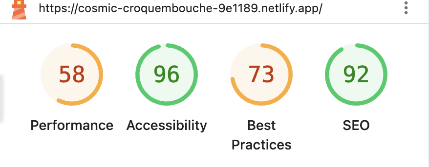
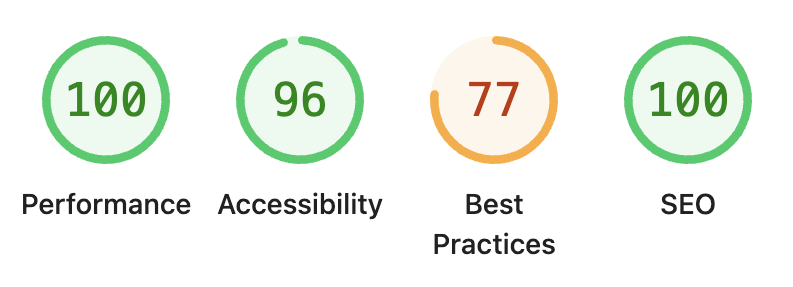

> My old portfolio shipped **519 KB of mandatory JavaScript** to render what was mostly a blog. The rebuild ships **23 KB**, and if JavaScript fails, the website still works.

My 2024 portfolio was an app pretending to be a content site. My 2026 portfolio is a content site pretending to be an app.

To be honest, the 2024 build was sloppy, juvenile, reaching for more than I knew how to do cleanly at the time. ~40 dependencies, a lot of them just there to "look cool." This is the rebuilt-from-scratch version: Astro 7, Content Collections + MDX, Tailwind v4, and a thin layer of progressive-enhancement JS (Lenis + anime.js + View Transitions). ~96% less JavaScript, the actual content back in the HTML, and the SEO/a11y/security problems fixed along the way.

## The 2024 site

In 2024 I built a React + Vite site for myself, biography, portfolio, blogs, whatever interested me. I wanted the nav reinvented as a sticky sidebar hosting music, live weather, a clock. Very early-2000s-GeoCities inspired. And honestly, it was great... in some ways.

| Criterion | Score | One-line verdict |
| --- | --- | --- |
| Aesthetic and UX Execution | 8/10 | Strong, cohesive point of view. Clean modern skeleton under the retro dressing; layout works. |
| Performance | 3/10 | Ships three.js to paint a solid color. Bloat everywhere. |
| SEO | 3/10 | CSR SPA, meta tags commented out. A blog nobody can find. |

**Aesthetic and UX** was the real strength. The goal was always simple but pleasant to digest — nothing too bold or disorienting. I'm drawn to sites like the ones on [NeoCities](https://neocities.org/browse?sort_by=views&tag=2000s): pragmatic but fun, taste beaming through without hurting function. Main content + sticky sidebar still feels clean to me, and I'm happy with how that turned out.

**Performance was honestly ridiculous.** The funniest example: I was shipping three.js just to render a white background.

```jsx
<color args={["#f5f5f5"]} />
```

One line of CSS, but instead it was 150 KB of WebGL. I'd wanted some cool 3D background effects, hated the result, kept the canvas "just in case." That pretty much summarizes the old codebase. The content here is mostly text and a handful of images and the payload was wildly heavier than the content justified.

**SEO** was another expensive failure. Pure client-rendered SPA, the served HTML is an empty div, none of the content exists in the markup a crawler first sees. `react-helmet-async` was installed but commented out, so there were zero per-route meta tags: every page shared one static `<title>saman shaiza</title>` and one description from `index.html`. No per-post titles, no Open Graph / Twitter cards — bad ranking and ugly, contentless link unfurls. No `sitemap.xml` either. The Netlify `/* → /index.html` redirect is correct for SPA routing, but it just reinforces that everything is the same empty shell.

The Lighthouse numbers weren't pretty:



versus where we land in 2026:



There's more I won't get into, but the throughline is this: this codebase showed exactly what kind of engineer I am, high velocity, experimental, messy but progress-driven, willing to ditch ideas for something better, not afraid to keep moving. Which also means a lot of dead code piles up.

## The 2026 rebuild

I like the idea of a site that evolves. It makes the thing feel alive, so I wanted to keep the vibe and structure, just fix everything underneath: pick up an SSG (Astro is the obvious fit for a content site — zero JS shipped, MDX-native, SEO and font/image performance basically solved for free), drop R3F and every unused library, replace motion/framer-motion with anime.js, self-host the GIFs.

The tempting instinct was to bolt on a backend so I could store more blogs, images, audio. But no, a backend makes a content site *slower*, not faster. Astro renders content to static HTML at build time; adding a runtime fetch would add a round-trip for content that never changes per request. Dumb.

The rule I landed on is pretty standard:

| Content | Where | How |
| --- | --- | --- |
| Blog + reviews (`.md`/`.mdx`) | in-repo `src/content/` | Content Collections → static HTML |
| Inline images | in-repo `src/assets/` | Astro `<Image>` (sharp) — responsive/lazy/WebP |
| Audio, large media | object storage (Cloudflare R2), by URL | never committed to the repo, CDN handles range requests for seeking |

Blogs and reviews got consolidated into one collection, so adding content is now just dropping a file.

**Performance:** zero JS by default — that's just what static Astro HTML gives you. The 23 KB we do ship is Lenis (smooth scroll) + anime.js + Astro's View Transition client, all enhancement, all gated on `prefers-reduced-motion`.

**Self-hosted GIFs**, pulled from the Wayback Machine instead of hot-linking archive.org. Hot-linking was just silly.

**Font subsetting + WOFF2 conversion**: 495 KB OTF/TTF → 173 KB WOFF2 (−65%) via `pyftsubset` from fonttools, subsetting down to the Unicode ranges the site actually uses (Latin, General Punctuation, Arrows, Misc Symbols for ★♡♪ etc.) instead of shipping full glyph inventories a personal English blog will never touch. Preload hints in `Layout.astro` for the two render-critical faces (PP Writer Regular, Hanken Grotesk).

**SEO:** per-page `<title>` and `<meta description>` plus Open Graph / Twitter card / canonical, all driven through `Layout.astro` props. `@astrojs/sitemap` generates `sitemap-index.xml` at build. Content is server-rendered into the HTML, so crawlers and link unfurls see real text, not an empty shell. `og:image` points at the logo now, so shared links look intentional.

**Motion, done right:** every decorative animation respects `prefers-reduced-motion`, button hover lifts/shimmer, Lenis smooth scroll, anime.js scroll-ins, all gated. The head guard only hides `[data-animate]` when motion is allowed *and* JS runs, so no-JS / reduced-motion users always get fully visible content — no flash, no stuck-hidden state.

Astro 7 landed two days before I started the migration, so call it fate. Leaned hard into static output, islands, and Content Collections with the `glob` loader + Zod schema, frontmatter is type-checked at build, so a bad `date` or missing `title` fails the build instead of shipping broken. Built-in Shiki syntax highlighting meant dropping `prism-react-renderer`/`react-syntax-highlighter` too. View Transitions were the real find — SPA-style navigation with the persistent sidebar (a core part of the 2024 feel) without needing React Router at all.

## The numbers (measured 2026-06-27)

Both built locally. 2024 measured with `npx vite build` (TS check skipped; bundle is representative). 2026 measured with `astro build`.

| Metric | 2024 (React/Vite SPA) | 2026 (Astro 7 static) | Delta |
| --- | --- | --- | --- |
| JS shipped (gzip) | 519.36 KB (one chunk) | 22.83 KB total | −95.6% (~22.7× smaller) |
| JS shipped (raw) | 1,851.31 KB | 65.4 KB | −96.5% |
| JS is… | required to render anything | optional enhancement | — |
| CSS (gzip) | 8.41 KB | 6.99 KB | −17% |
| Served HTML | 0.65 KB empty shell (`<div id="root">`) | full content in markup (home 16 KB raw / 4.5 KB gzip; a blog post 72.7 KB raw / 11.1 KB gzip) | content is now *in* the page |
| Direct dependencies | 38 deps + 19 devDeps = 57 | 7 deps, 0 devDeps | −88% |
| `node_modules` on disk | 386 MB | 168 MB | −56% |
| Build output | 1 monolithic JS chunk (Vite warns >500 KB) | 10 pre-rendered HTML routes + 2 small JS files | — |
| Build time | ~4.82 s (bundle only) | ~2.9 s total / 1.32 s page-gen for 10 routes | — |
| Favicon | `Photo-1.jpeg` — a 764 KB JPEG | generated 16/32/180 px PNGs (sub-KB) | — |
| Fonts | 3× OTF (~125 KB each), only Regular `@font-face`'d | 4× subset WOFF2, 173 KB total (−65%) + preloads | done |
| Lighthouse (lab) | not measured at rebuild time | Perf 99 · A11y 96 · Best Practices 77→~95 after headers · SEO 100 | — |

519 KB of gzipped JavaScript down to 23 KB — and the old 519 KB was load-bearing, the page was blank without it, while the new 23 KB is pure enhancement: smooth scroll, scroll-in animations, SPA-style nav. The 1.85 MB raw 2024 chunk included React, React Router, **both** `framer-motion` and `motion`, and three.js — the last of which existed to render `<color args={["#f5f5f5"]} />`, a solid color one line of CSS does for free.

All that being said, the 2024 site was not a mistake, it's how I learned what mattered. That there's a difference between a site that looks like it cares and one that actually does. I've uploaded the 2024 site [here](https://cosmic-croquembouche-9e1189.netlify.app/) so you can go see for yourself which one you like better.
